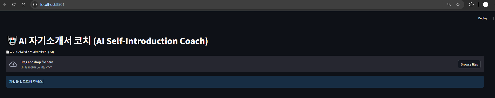
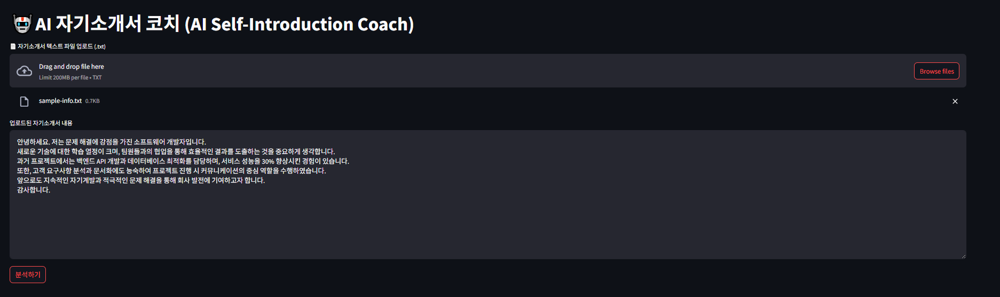
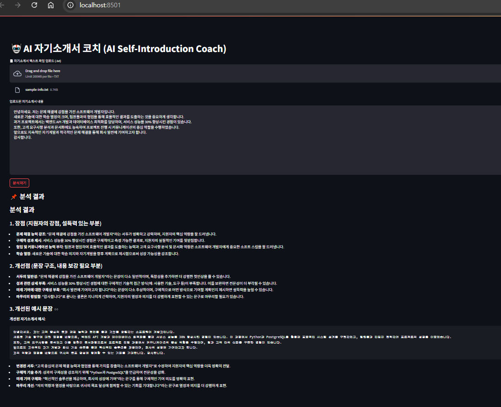

# (자기소개서 피드백 AI Agent - AI Bootcamp Final Project)

## **1. 과제 개요 - 프로젝트 기획 배경 및 핵심 내용**

*   AI 기술을 활용해 자기소개서 작성에 어려움을 겪는 구직자들을 효과적으로 지원하기 위해 기획함
*   자기소개서 내용을 단순 문장 분석이 아닌, 유사 사례 기반 정보 검색과 AI 피드백 생성으로 심층 분석 및 개선점을 제시하는 문제 해결
*   AI Agent는 업로드된 자기소개서를 벡터 DB에 저장 후, RAG 방식을 통해 유사 문서 참고해 GPT-4o 기반 피드백 생성 및 사용자에게 제공
*   사용자 친화적인 Streamlit UI를 통해 쉽고 빠르게 자기소개서 분석 결과를 받아볼 수 있으며, 맞춤형 피드백을 통해 실무 활용 가능성 높임
*   추후 멀티 에이전트 협업, 대화형 확장 및 배포환경 구성까지 염두에 둔 설계

## **2. 기술 구성 - 프로젝트에 포함된 주요 기술 스택**

**1) Prompt Engineering**

*   프롬프트 템플릿에 자기소개서 원문과 유사 문서 참고 정보를 포함하여 GPT-4o가 논리적이고 구체적인 피드백을 생성하도록 최적화함
*   재사용 가능한 템플릿 설계로 다양한 입력에도 일관된 응답 품질 유지

**2) Azure OpenAI 활용**

*   Azure OpenAI GPT-4o 모델 및 Azure 임베딩 모델(text-embedding-3-large) 사용
*   환경변수로 API 키, 엔드포인트, 배포 이름, API 버전 관리하여 보안성과 유지보수성 확보
*   AzureChatOpenAI 및 AzureOpenAIEmbeddings 클래스로 API 통합 구현

**3) RAG (Retrieval-Augmented Generation)**

*   입력 텍스트를 문단 단위로 분할 후 임베딩하여 FAISS 벡터 DB 구축
*   자기소개서와 유사한 문서 조각을 검색해 AI가 참고할 컨텍스트 제공
*   RAG 방식으로 단순 생성보다 근거 기반 신뢰도 높은 피드백 생성 가능

**4) Streamlit 및 서비스 개발/패키징**

*   Streamlit 웹 UI로 파일 업로드, 분석 실행, 결과 확인의 사용자 플로우 구현
*   처리 중 스피너 표시, 빈 입력 알림 등 UX 개선
*   향후 FastAPI 연동, Docker 배포 계획 가능

## **3. 주요 기능 및 동작 시나리오 - AI Agent 사용자 흐름**

**사용자가 어떤 입력을 하면, AI가 어떤 방식으로 데이터를 처리하는가, 최종적으로 어떤 결과를 제공하는가 등**

*   **사용자 플로우(Flow) 다이어그램을 첨부해주세요**

1.  **파일 업로드**: 사용자는 웹 애플리케이션에 접속하여 자기소개서가 담긴 **텍스트 파일(.txt)**을 업로드합니다.

2.  **텍스트 확인**: 업로드된 텍스트 내용이 화면에 표시됩니다.

3.  **분석 요청**: 사용자가 "**분석하기**" 버튼을 클릭하여 피드백 프로세스를 시작합니다.

4.  **AI 분석**: 애플리케이션이 텍스트를 처리하고 멀티 에이전트 파이프라인이 분석을 수행합니다.

    *   **에이전트 1 (분류)**: 사용자 입력을 분류합니다.
    *   **에이전트 2 (RAG 검색)**: 자기소개서 내용으로 구축된 벡터 데이터베이스에서 관련 문서를 검색합니다.
    *   **에이전트 3 (피드백 생성)**: 검색된 정보를 바탕으로 종합적인 피드백 보고서를 생성합니다.

5.  **결과 확인**: 최종 피드백 보고서가 사용자에게 표시되며, 장점, 개선점, 개선된 예시 문장 등을 확인할 수 있습니다.

*   **프로젝트의 서비스 아키텍처 다이어그램을 첨부해 주세요**

이 프로젝트의 서비스 아키텍처는 클라이언트-서버 모델을 기반으로 하며, 여러 컴포넌트와 멀티 에이전트 시스템을 활용하여 구성됩니다.

1.  **프론트엔드 (Streamlit)**: 사용자가 직접 상호작용하는 부분입니다. 파일 업로드, 텍스트 표시, 그리고 최종 피드백을 보여주는 역할을 합니다.

2.  **백엔드 (Python/LangChain)**: 애플리케이션의 핵심 로직이 실행되는 부분입니다.

    *   **RAG 시스템**: `backend/rag.py` 모듈이 **검색 증강 생성(RAG)** 프로세스를 담당합니다. 업로드된 텍스트를 청크로 나누고, Azure OpenAI Embeddings를 사용해 벡터 임베딩을 생성한 후, FAISS 벡터 데이터베이스에 저장합니다.

    *   **멀티 에이전트 파이프라인**: `backend/agent.py` 모듈이 LangChain을 사용하여 세 가지 에이전트의 작업을 조율합니다.

        *   **에이전트 1 (분류)**: GPT-4o 모델을 사용하여 사용자 요청을 분류합니다.
        *   **에이전트 2 (RAG 검색)**: FAISS 벡터 데이터베이스에 질의하여 사용자의 자기소개서에서 관련성이 높은 텍스트 청크를 검색합니다.
        *   **에이전트 3 (피드백 생성)**: 검색된 정보와 미리 정의된 프롬프트(`SELF_INTRO_FEEDBACK_PROMPT`)를 사용하여 GPT-4o 모델로 상세한 피드백을 생성합니다.

3.  **LLM (Azure OpenAI)**: 임베딩 모델과 GPT-4o 모델(분류 및 피드백 생성) 등 모든 AI 모델은 Azure OpenAI에 호스팅되어 있습니다. 애플리케이션은 환경 변수를 통해 이 모델들에 연결합니다.

## **4. 프로젝트 실행 방법 (참고)**

1. 필수 라이브러리 설치 : `pip install -r requirements.txt`

2. `.env` 파일에 Azure OpenAI 관련 환경 변수 설정

3. Streamlit 앱 실행 `streamlit run app.py`

4. 웹 브라우저에서 `http://localhost:8501` 접속 후, 자기소개서 텍스트 파일 업로드 및 분석

## **5. 프로젝트 산출물 - 최종 제출 파일**

**1) 소스 코드**

*   Streamlit 앱(`app.py`), 에이전트 로직(`agent.py`), RAG 벡터 DB 처리(`rag.py`), 프롬프트 정의(`prompts.py`) 등 포함.

**2) 스크린샷**

(1) 초기 화면

(2) 자기소개서 텍스트 업로드

(3) 분석 버튼 클릭 시 분석 결과 출력

